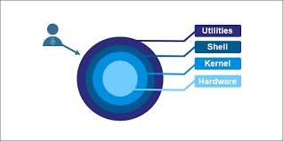
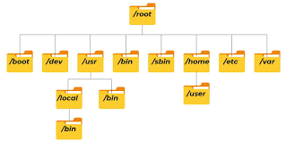
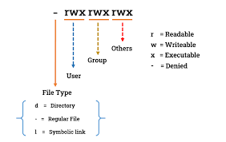
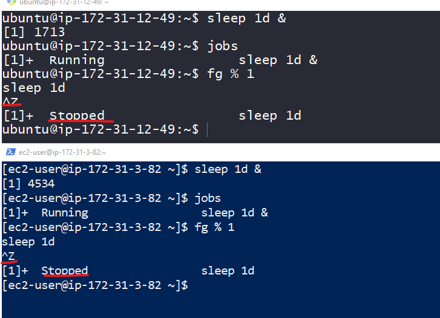
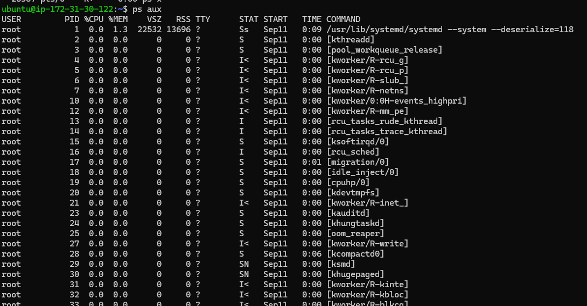
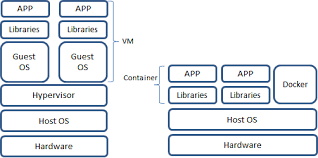
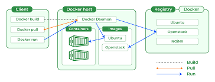

##### **Day 1**
--------------------------------------------------------------------------------------------
##### What is Operating System?
A operating system is system software that manages computer hardware and software resources and provides common services for computer programs. Operating system is a bridge between hardware of the computer and the users.

###### What is Linux?
Linux is an open source operating system that is made up of the kernal, the base component o the OS and the tools, apps, and the services bundled along with it.<br>
- Linux is free and do not have to worry about paying anthing at all.
- Allowing you to make changes to its code and adding new functionality to be used by other users.
- It is one of the best secure and stable OS, and it is very low chance of getting attacked by any hackers or virus
- Linux does not require much memory and space effectively working. It  is very low system requirements.
- We can run along with linux and windows in one system and within windows using virtual machines.<br>
##### Why choose Linux?
- Linux is widely used for troubleshooting purpose for other computer.
- We want to build or host a website.
- It is one of the secure and robust operating system and most stable one.

##### Linux for DevOps

Linux is important for DevOps because it provides an environment needed to manage infrastructure, automate tasks and troubleshoot issues. Linux is backbone of the devops.
- A core goal of DevOps is fast software delivery and building on existing infrastructure, linux is big part of that.
- Linux and any other OS is an essential component of any IT operation, to know how to configure Linux for DevOps is essential to a continual and speedy software delivery process.
- It enables the creation of design and security applications to a specific development environment or set of development objectives. Compared to Windows, there is a lot more control over how the operating system operates.
- Most of the DevOps tools are Linux based tools and supports linux. DevOps engineer may easily and internally do all testing using a Linux-based operating system
- Scalability enables fast delivery without forcing developers to compromise the quality of their codebase.

###### **Linux Architecture**



- **Hardware**: It consists of all peripheral devices such as RAM, CPU, HDD etc... 
- **Kernal**: It is the central component of an operating system. It means harware resuorces, system calls and provide essential services to applications.
- **Shell**: Shell takes commands from the users and execute kernal functions. It is a commandline-interpreter that lets linux users control their operating systems with CLI (commandline interface).
- **Utilities**: Provides a set of functions and routines that application use to  interact   with the kernal and perform various tasks.

##### Linux Filesystem Hierarchy Structure


    1) `/root :` The top most directory of the filesystem. All files and directories start from the root directory.
    2) `/bin(Binaries:)` It contains user commands binaries or executables like ls, mv, cp, rm etc. Thease commands are available for all users.
    3) `/sbin(System Binaries):` It contains system commands binaries used for administrative tasks like ifconfig, fdisk, htop, dh -f, etc.
    4) `/boot:` This directory contains booting files for the system and bootloader configuration files.
    5) `/dev(Devices):` Contains device files representing hardware devices such as disks(/dev/sda), USB devices, terminals(/dev/tty) 
    6) `/etc(Configuration files):` This directory contains system-wide configuration files and shell scripts for system initialization. Filesystem tables(/etc/fstab), network hosts(/etc/hosts), user information(/etc/hostname).
    7) `/home:` This is the home directory for all user. Every user personal files and documents stored here.
    8) `/ lib(Libraries):` It contains shared library files for required by the binaries in /bin and /sbin. Libraries are essential for the basic functionality of the system.
    9) `/media:` A mount point for removable media like USB drivers, CDs and DVD. When we inserted these media then automatically mounted under /media.
    10) `/mnt(Mount):` It is a temporary mount filesystem. Users use it to mount filesystem temporarly.
    11) `/opt(Optional):` It contains third party application installations.
    12) `/var(Variable files):` It contains variable data files such as logs(/var/log), databases(/var/lib) and cached files(/var/cache). This is a read and writable directory used for files change frequently.
    13) `/run:` Stores runtime data for processes since the system was booted. This data is typically volatile and not persistent across reboots.
    14) `/srv(Service):` Contains data for services provided by the system, such as web servers, FTP servers, or databases (e.g., /srv/www for web server files).
    15) `/sys(System):` A virtual filesystem providing information about devices, kernel modules, and other kernel-related data structures.
    16) `/tmp(Temporary Files):` A directory for temporary files created by applications and the system itself. Files in /tmp are typically deleted on reboot or after a certain period.
    17) `/usr(User Binaries & Read-Only Data):` Contains user utilities and applications. It is divided into subdirectories such as /usr/bin (non-essential command binaries), /usr/sbin (non-essential system binaries), /usr/lib (libraries), and /usr/share (shared data like icons, fonts, and documentation).
    18) `/proc(proces):` This directory contains information about the system process. (/proc/cpuinfo), (/proc/meminfo). 

###### **Basic Linux Commands**


- `ls :` This command is used to list the contents of the directory
- `cd :` This command used to change the directories
- `pwd :` This command will show present working directory
- `cp :` This command is used to copy the files
- `mv :` This command is used to rename the files and directiries and move files or directories one directory to another 
- `rm :` This command is used to remove file or directories 
- `mkdir :` This command is used to create directories 

###### **Linux File Permissions**


- `File Access Modes :-` The permissions of a file are the first line of defense in the security of a linux system. The basic building blocks of linux permissions are the read,write, and execute permissions, which have been explained below 

- `Read :-` Access to a directory means that the user can read the contents. The user can look at the filenames inside the directory.
- `Write :-` Access means that the user can add or delete files from the directory.
- `Execute :-` Executing a directory doesn't really make sense, so think of this as a traverse permission.


| **NUMBER** | **PERMISSION REPRESENTATION**  |    **REFERENCE**     |  
|------------|--------------------------------|----------------------|
|     0      |     No permission              |        --            |
|     1      |     Execution permission       |        --x           |
|     2      |     Write permission           |        -w-           |
|     3      |  Execute & Write permission    |        -wx           |
|     4      |      Read permission           |        r--           |
|     5      |  Read & Execute permission     |        r-x           |
|     6      |  Read & Execute permission     |        rw-           |
|     7      |Read, Write & Execute permission|        rwx           |


###### **Changing File permissions and Ownership and groups**
Each file and directory in Linux has three types of permissions (read, write, execute) for three types of users (owner, group, others).
- **Changing Ownership:**
-  To change the owner and group of a file or directory:
  ```bash
$ sudo chown saikrishna:voziq task.txt
```
```
chmod +rwx filename: Adds permissions
chmod -rwx directoryname: Removes permissions
chmod +x filename: Allows executable permissions
chmod -wx filename: Takes out write and executable permissions
chmod +rwx filename: Allows Read and write execute permissions
chmod g+w filename: Changes directory permissions for group owners 
```

##### **User and Group management**


In Linux, user and group management is essential for controlling access to files, directories, and system resources. Overview of the key concepts and commands related to user and group management.
User and group management in Linux allows administrators to control access to system resources efficiently. By assigning users to groups, administrators can manage permissions on files, directories, and processes, ensuring that the system is secure and users have appropriate levels of access.

**1. Users in Linux**

 **`Users types:`**
 - **`Root User:`** This user is superuser. This user have complete control over the system. This user can perform any action, including administrative tasks.
 - **`Regular User:`** A non root users or non-priviliged user. This user have limited permissions. This user can have only permissions for modify files and directories they own.
 - **`System User:`** This users created by systems. This users don't have login access and used run background process.
- A user have Username, UID(user id), Home directory of a user and Shell.

**2. Groups in Linux**

Groups are collections of users, which allow for easier management of file permissions and system access.
- **Primary Group:** Every user is a member of a primary group, which is specified when the user is created. Files created by the user are usually associated with this group.

- **Supplementary (Secondary) Groups:** Users can also belong to additional groups, which provide extra permissions.
- A group have Group Name and Group ID. 

###### **3. User and Group Files**


- **/etc/passwd:** Contains user account information.
- **/etc/group:** Contains group information.
- **/etc/shadow:** Contains encrypted password information.

- **Create user and Password changing and changing one user to another**
  - Creating user in linux using `useradd` and `adduser` and check the users list in linux using `/etc/passwd` command
  
  
  
  - Change the password of the user using `passwd` command and change one user to another user
  how to change the password
   
  changing one user to another user in linux
  
- **Create group and add that group to user**
    Create group using `groupadd` command and add user to that group using `usermod` command and check the group is created or not
    

    check the user is created or not using `cat /etc/group`
    

    


  - 


##### **EXCERCISES FOR DAY-1

**1. Create, move and delete files and directories**
 - Created directories and files using `mkdir` and `touch` commands
 Created directories spet, abc1, abc2 and abc3

Created fies file1.txt, file2.txt and file3.txt
 

- Changing one directory to another using `cd` command


- Moving a file to dirctory using `mv` command


- List files in a directory using `ls` command


- Removing or deleteing a directory or file using `rm` command


- Using `pwd` command for current working directory


**2. Practice using basic shell commands to interact with the file system**

- Finding and Searching
`find:` Finds files and directories based on conditions.

```bash
$ find /abc2 -name "file1.txt"
```
```bash
$ grep "test" file2.txt
$ grep -r "test" /abc1/file1.txt
```
- Viewing file contents

`less` This command allow you to view the content of file page by page
```bash
 $ less file3.txt
 ```
 `head & tail` These commands will display the first and last lines of a file. head is first lies and tail is last lines
```bash
$ head file1.txt
$ tail file2.txt
```
- Copy the files or directories

`cp` This command is used to copy the files or directories
```bash
$ cp file3.txt abc3
```
**3. Create files with different permission settings and modify them using `chmod`**
- I am giving a directory to some permissions like `644` users=read+write, group=read, others=read

- Giving permissons to a file for `755` users=read+write+execute, group=read+execute, others=read+execute
```bash
$ chmod 755 file2.txt
```
---------------------------------------------------------------------------------------------------------------------

#### **Day-3**
#### **Process Management, System Monitoring and Networking**

##### **Process Management**
- **Process** A process is basically a program that is executing. Executing the program happens in sequentials. To run anything on OS, a process has to be created 
  - A program is loaded into memory and it becomes process. Process has 4 sections
      - `Stack:` Stack contains temporary data such as what method/function parameters, return addresses & local
      - `Heap:` This is dynamically allocated to process
      - `Data:` Global & static variables
      - `Text:` Program counter, process register
      - **Process Life cycle** 
        - Start
        - Ready
        - Running 
        - Waiting
        - Terminated or exited  
- **What is Process Management**
The main functions of process management include starting, stopping, and arranging processes within an operating system. Consider a process as an instance of a program currently running, complete with its execution environment, memory, and CPU state. Due to its ability to manage several processes concurrently, Linux is a multitasking operating system that enables users to run multiple programs simultaneously.
  - **There are two types of processes :**
    - **1.Foreground :** These are the processes which are to be executed or initiated by the user or the programmer, they can not be initialized by system services. Such processes take input from the user and return the output.
    - **2.Background :** These are the processes that are to be executed or initiated by the system itself or by users, though they can even be managed by users. These processes have a unique PID or process if assigned to them and we can initiate other processes within the same terminal from which they are initiated.
    - **3.Stopped**
  - **Commands and examples**
    - `jobs:` List the jobs
    - `fg %n:` Bring the current or specified job in the foreground
    - `bg %n:` Place the current or specified job in the background
    - `Conytol-z` Stops the foreground job & places it in the background as stopped job
  - **Examples**
    - `sleep 1d &`  job placed in the background
    - `fg %1` job placed in the foreground (1 is job id number)
     

- **Commands for Process Management in Linux**
  - Linux provides several commands for managing processes
  - **`ps`** Report the snapshot of the current process. This command will show static info
    **`ps x`** This command will show all of the our process regardless of what terminal they are controlled by.
    **`ps aux`** 
    **a**= All board: Every process, regardless of its owner, is displayed, democratizing process management.
    **u**= Know they user: It adds a human touch, showing the user behind each process, along with vital stats like CPU and memory usage.
    **x**= The hidden: Even processes lurking in the shadows, without a terminal to call home, are brought into the light. 
    
    
      - Explaination of the above proces `State`
        R : Running
        S : Sleeping
        D : Uninterruptible sleep
        T : Stopped
        < : A priority process
        N : A low priority process
    
      - Explanation of the above process
        USER : User ID this is owner of the process
        %CPU : Cpu usage in percent
        %MEM : Memory usage in percent
        VSZ  : Virtual memory size
        RSS  : Resident set size. This is amount of physical memory the process is using in kilobytes
        START: Time when the process is started 

###### **Managing process commands**

  - **`top`** This command will provides all running Linux process. This command will show dynamic info. 
              It helps in monitoring system usage and performances. It is mainly used to detect load on the server by system administration. I
              The top command stands for table of processes. It is a task manager program, detected in several Unix-like operating systems, that shows information about memory and CPU utilization.
  - **`htop`** This command will provide real time monitoring of process and performs every tasks to monitor the process in the linux system. It is new and updated command of top command

  - **`kill`** The `kill` command used to kill the process in linux. Every process will have process ID. To kill a process in linux use `kill` command and PID.

  - **`pkill`** This command uses name of the process instead of PID. Signal can be send to a process either by typing full name or partial name.

  ###### **System monitoring commands and tools**

  - **`df`** Check the status of various partitions and drives on server to see how full they are. To see the mounted partitions, their mount points and amount of disk space.
    - `-a, --all` Includes all file systems, including dummy file systems with zero block sizes. `df -a` & `df -all`.
    - `-B, --block-size=S` Scales sizes by the specified size (-BM shows sizes in megabytes). `df -B`
    - `--total` Displays a grand total of all file systems. `df --total`
    - `-h, --human-readable` Prints sizes in human-readable format (e.g., KB, MB, GB).`df -h` & `df --human-readable`
    - `-H, --si` Uses powers of 1000 (e.g., kB, MB) instead of 1024. `df -H`
    - `-i, --inodes` Displays information about inodes instead of block usage. `df -i` & `df --inodes`
    - `-k`  Displays file system information and usage in 1K blocks (default behavior). `df -k`
    - `-l, --local` Displays only local file systems, excluding network file systems. `df -l` & `df --local`
    - `-P, --portability`  Uses the POSIX output format. `df -P` & `df --portability`
    - `-t, --type=TYPE` Displays only file systems of the specified type. `df -t squashfs`
    - `-T, --print-type` Displays the type of each file system. `df -T <file>`
    - `-x, --exclude-type=TYPE` Excludes file systems of the specified type from the output. `df -x <file>`
    - `--no-sync`  Does not invoke sync before getting usage info (default). `df --no-sync`
    - `--sync`  Invokes sync before getting usage info, ensuring the output is fully up to date. `df --sync`
    - `--help`  Displays a help message and exits. `df --help`
    - `--version` Displays version information and exits. `df --version`
    - `-V`  Ignored, included for compatibility reasons. `df -V`
  

  - **`du`** To see the disk usage of the each file in bytes.
    - `-a`          Show disk usage of all files, not just directories.                      `du -a <path>`        
    - `-c`          Produce a grand total.                                                   `du -c <path>`        
    - `-h`          Display sizes in human-readable format (e.g., KB, MB).                   `du -h <path>`        
    - `-s`          Display only a total for each argument.                                  `du -s <path>`        
    - `-S`          Do not include size of subdirectories.                                   `du -S <path>`        
    - `-x`          Skip directories on different file systems.                              `du -x <path>`        
    - `--max-depth=N` Show the total for a directory (or file, with -a) only if it is N or fewer levels below the  command line argument.                                                                 `du --max-depth=1<path>`
                                                                                                      
    - `--exclude=PATTERN`  Exclude files that match PATTERN. `du --exclude=PATTERN`                                                            
                                                                                                  


  - **`free`** This command which displays the total amount of free space available along with the amount of memory used and swap memory in the system. It displays the all details regarding the RAM usage such as how is the total, what is used and free memory including buffers and cached data, aiding in real time monitoring of memory resources.
      - `-k (kilo)`  Display the memory usage in kilobytes. `free -k`
      - `-m (mega)`  Display the memory usage in megabytes. `free -m`
      - `-g (giga)`  Display the memory usage in gigabytes. `free -g`
      - `-tera`      Display the memory usage in terrabytes.`free -tera`
      - `-h (human)` Automatically scales all output columns to the shortest three-digit unit and display the units. `free -h`
      - `-c (count)` Display the output `c` number of times
      - `-l (lohi)`  It will show detailed low and high memory statistics. `free -l`
      - `-o (old)`   It will Disables the display of the buffer-adjusted line. `free -o`
      - `-s (seconds)` It will continuously displays the output after `s` seconds delay. Uses the usleep system call for microsecond resolution delay times. `free -s`
      - `-t (total)` Adds an additional line in the output showing column totals. `free -t`
      - `-help`      Displays a help messege and exits. `free -help`
      - `-V (version)` Displays version information and exits. `free -V`


  - **`uptime`** This command will display the information from how long the system is running, how many users login and load average
      - `-p (pretty)` It will show the uptime in pretty. `uptime -p`
      - `-h (help)`   It will display the help and exit
      - `-s (since)`  It will show the when system is up since
      - `-V (version)`It will display the version information and exit   

  ###### **Networking commands**

  - **`ifconfig`** This command will display all the active network interface configuration details that includes their assigned IP addresses, netmask, and other relevant information.
      - `-a`   Display all interfaces, including those that are down. `ifconfig -a`
      - `-s`   Display a short list, instead of details. `ifconfig -s`
      - `-v`   Run the command in verbose mode. `ifconfig -v`
      - `up`   To assign an IP address to a network interface. `ifconfig eth0 <IP Address> netmask <> up`
      - `down` To remove an IP address to a network interface. `ifconfig eth0 <IP Address> down`
      - `arp, [-]arp` Enable/disable the use of ARP protocol on an interface. 
      - `netmask` Changes the network mask for a specific interface. `ifconfig interface netmask <mask_IP>`
      - `broadcast` Sets the broadcast address for a specific interface. `ifconfig interface broadcast <broadcast_IP>`
      - `-promisc, [-]promisc`  Enable/disable promiscuous mode on an interface. The promiscuous mode lets a network device receive all types of packets. It’s commonly used for checking network activities. `ifconfig interface promisc`
      - `-allmulti, [-]allmulti`  Enable/disable all-multicast mode for an interface. `ifconfig interface -allmulti`
      - `-mtu`  Sets the Maximum Transfer Unit (MTU) of an interface. The maximum transmission unit (MTU) restricts the size of packets that can be sent via an interface. Use the mtu argument with the ifconfig command to specify a value. `ifconfig interface mtu <number>`

      
  - **`ip`** This command is the newer version of the `ifconfig` command. It can be used to assign and remove addresses, take the interfaces up or down and much more useful tasks.

  - **`ping`** ping stands for (packet internet groper) is used to check the network connectivity between the host and server. This command takes as input the IP address or domains and sends a data pocket to the specified address with the message "PING" and get response from the server.
      - `-c` By default, ping sends unlimited packets until the user terminates the process. To send a specific number of packets, use the -c option. `ping -c 5 google.com`
      - `-a` The -a option will play a sound when the ping command receives a response from the target device. Since keeping Terminal open until it receives a response is inconvenient, this option is useful for network troubleshooting. `ping -a google.com/destination`
      - `-i`  To change the ping interval’s default value, use the -i option and specify the number of seconds. To set it faster than a second, use a decimal. `ping -i 0.5 destination`
      - `-s`  Specifies the number of data bytes to be sent. `ping -s 30 google.com`
      - `-v`  enables verbose output. `ping -v google.com`
      - `-V`  Check the ping version. `ping -V`
      - `-q`  Continuous ping monitoring can be tedious due to Terminal’s long output. To simplify the results, use the -q option. The command will summarize all the ping statistics in a single output, simplifying analysis. `ping -q google.com`
      - `-f`  The ping command lets you rapidly send packets in large quantities using the -f option. It helps simulate your server performance during a traffic spike or distributed denial-of-service (DDoS) attack. `ping -f google.com`
      - `-4, -6`  Due to internet development, the IPv4 IP addresses are running out, and IPv6 is becoming more common. The ping command’s default setting uses IPv4, but you can use either internet protocol.Add the -4 option to use the IPv4 address and -6 to send an IPv6 ping. `ping 4 google.com` & `ping 6 google.com `
      - `-s` By default, the ping command sends a packet with 56(84) bytes of data. 56 represents your packet size in bytes. Meanwhile, 84 specifies the total ping byte size, including all headers, which add 28 bytes. `ping -s 123 google.com`
      - `-D` To simplify network performance monitoring, the ping command lets you add a timestamp to the packet response. To do so, add the -D option using the following command. `ping -D google.com`
      - `-w, -W` The ping command has two timeout options, -W and -w. The -W option determines the time each ping will wait until the specified host sends a response. If it exceeds the time, the request is timed out. `ping -w google.com` & `ping -W google.com`


  - **`netstat`** netstat stands for (network statistics) This command helps for understand and check things about how your computer connects to the internet. It can tell you about the connections our computer is making, the paths it uses to send information, and even some technical details like how many pockets of data are being sent or received. It allows users to display network related information and diagnose various networking issues.
      - `-a`    Represents every socket, both non-listening and listening, and every protocol, like UDP, TCP, etc.`netstat -a`
      - `-at`   Represents TCP connections only (-au represents UDP connections only). `netstat -at`
      - `-ant`  Represents every TCP connection without DNS resolution (rather than displays IP addresses). `netstat -ant`
      - `-al`   Displays listening sockets only. `netstat -al`
      - `-aep`  Displays PID and to which function all sockets belong; e includes extra information like the user. Execute as root to check every PID. `netstat -aep`
      - `-s`   Displays network statistics and we can redirect out put to a file. `netstate -s > <file-name>`
      - `-i`   Shows a table of every network interface. Include -e to receive the result, which is the same as ifconfig. `netstat -i`
      - `-r`   Displays the information on kernel routing. It is a similar result as route -e. `netstat -r`
      - `-ct`  Shows TCP connections regularly. `netstat -ct`
      - `-g`   Shows the information of multicast group membership for IPv6 and IPv4. `netstat -g`
      - `-atnp`  Shows every "established" connection of TCP currently. `netstat -atnp | grep ESTA`
      - `-lntu`  Shows every service listening UDP and TCP, every free open port over the local device. `netstat -lntu`

  - **`curl`** This command is used to transfer data using various protocols such as HTTP, HTTPS, FTP, SCP, SFTP and more
      - `-X`  <HTTP_METHOD> – specifies which HTTP method to use. `curl -X GET <URL>/reource`
      - `-H`  “HeaderName: HeaderValue” sets custom HTTP headers for the request. `curl -H "HeaderName:HeaderValue" <URL>`
      - `-d`  “Data” – sends data in the request body. `curl -d <URL>`
      - `-o`  <output_file> – saves the response to a file. `curl -o <file-name> <URL>`
      - `-O`  Saves a remote file and save file it with the same name as in the URL. `curl -O <URL>` 
      - `-i`  Includes HTTP response headers in the output. `curl -i <URL>`
      - `-L`  Follows HTTP redirects. `curl -L <URL>/redirected-page`  
      - `-k`  Allows connections to SSL sites without certificates. `curl -k --head <URL>/login`
      - `-v`  Provides verbose output for debugging. `curl -v <URL>`
      - `-T`  In addition to downloading, `curl` can also upload files to a server using various protocols. `curl -T <uploadfile.txt> ftp:<URL>/upload`
      - `-u`  The curl -u command is used for making HTTP requests with authentication. The -u option is followed by a username and an optional password, separated by a colon. This allows you to include credentials in your request. `curl -u <UserName>:<Password> <URL>/resource`

  ###### **SSH (Secure Shell/Secure Socket Shell)**

  - **SSH** Stands for **Secure socket shell** and **Secure shell**. SSH is a widely used network protocol that provides a secure way to connect remote servers. It provides a secure encrypted connection between two hosts over an insecure network. This connection can also be used for terminal access, file transfers, and for tunneling other applications.
  - SSH protocol uses symmetric encryption, asymmetric encryption and hashing in order to secure transmission of information.
      - Encryption and Decryption have two ways
        - Symmetric encryption
        - Asymmetric encryption
      - **Symmetric encryption :** In symmetric encryption both users will have same key to encrypt and decrypt.
      - **Asymmetric encryption :** In asymmetric encryption both users will create a keypair and both keys are different. One key is called public and other key is called private.
        - If the message is encrypted with public key it can be decrypted with private key and other way arount
  - **Telnet** was used to communicated with a remote server, Telnet is not secure communication protocol & it transfers the data over network/internet in a plane text, so to overcome this issue **SSH** came into existence.
  - **SSH** protocol provides the secure way of accessing remote servers.

  ###### **How SSH works** 
  -  SSh Protocol uses symmetric encryption, asymmetric encryption and hashing in order to secure transmission of information.
  - SSH Connection between client and server happens 3 stages
     **1.** Verification of server by the client
     **2.** Generation of session key to encrypt all the communication
     **3.** Authentication of the client by server

     **Process for Verification of the server by client**
       Client initiates ssh connection with server. Server listens to ssh connections by default on port 22. At this point is server identity verified, but we have two cases 
       **1.** Communication b/w client and server for the first time:
           - client is asked to authenticate the server manually by verifying the public key of the server. Once the key is verified, the server will be added to ~/.ssh/known_hosts.
       **2.** If the client is not accessing the server for the first time server’s identity will be matched with previously recorded information on known_hosts file

  ###### **Package Management In Linux**
  - package manager is a software tool used for package management in Linux i.e. to manage the installation, removal, and updating of various software packages. It can be thought of as a hub for all software packages available for your system. The package manager keeps track of all the installed packages on the system, including their dependencies, and uses this information to resolve conflicts and handle updates.
  - Software packages are collections of files, including executables, libraries, configuration files, and documentation, that are bundled together for easy distribution and installation. Package managers keep track of these packages, making it easier to manage software on a Linux system.
  - Functionality of package manager in linux
    - Installation
    - Dependency resolution
    - Upgrading
    - Remove
    - Querying 
##### **Package managers in linux**


1. **Repository :**
    - A linux repository is a storage location from which our system can install applications as well as Operating system updates.
    - Each repository is collection of software hosted on remote server so that it can be used  many systems for installing/updgrading softwares (packages)

2. **RPM (Red Hat Package Manager):** 
    - RPM is a software management system that is used for update, install, uninstall, query and verify of software packages.
    - A package typically consists of archive of files and other metadata, includes configuration files, binaries.
    - RPM is pre-install on all redhat flavors like centos, rhel, fedora, Amazon linux etc…
  
3. **DPMS (Debian Package Management System):**
    - DPMS is the framework for managing software on Debian or Debian-like systems. Debian packages end with .deb
    - At the core of DPMS is the dpkg application which works with the system providing several command line options.

  ###### **Automatic updates and package installers**
  

1. **YUM (Yellowdog Updater Modified):**
    - yum is a popular packaging/updating tool for managing software on Linux systems. It is basically a wrapper program for RPM with enhancements.
    - Yum is pre installed on rhel family like centos, redhat, amazon linux
    - Yum configuration is located at /etc/yum.conf provides system-wide configuration options for yum.
    - In yum we can navigate to /etc/yum.repos.d
    - If you want to add a repo create a file with .repo extension in `/etc/yum.repos.d`
2. **APT (Advanced Package Tool):**
    - APT is a tool for managing packages on ubuntu based systems
    - APT is a powerful and widely used package manager in the Linux. It’s the default package manager for Debian-based distributions, Ubuntu, and Linux Mint. APT is software management, ensuring that users can easily install, update, and remove packages taking care of dependencies.
3. **DNF (Dandified YUM):**
    - DNF makes it easy to maintain packages by automatically checking for dependencies and required to install packages. This method to we can manually install or update the package, and its dependencies, using the dnf command. DNF is now the default software package management tool in Fedora.

##### **Configuration files**
1. **/etc/hosts :**
  - The /etc/hosts file in Linux or any other operating system is used to map connections between IP addresses and domain names.
  - When you want to block certain websites.
  - It can be used as a backup in the case when DNS is broken.
  - You can also use it as a local DNS server.
2. **/etc/fstab :** 
  - Fstab is a file system table used by the kernel during boot time to mount the file system. To put it in simple terms, you will create one or more partitions on your hard drive and you will make an entry for each partition in fstab which will be read by the kernel during boot time and the file system will be automatically mounted.
  - By default, any partitions you create during the OS installation will be automatically added to the fstab file.

3. **/etc/ssh/sshd_config :**
  - The /etc/ssh/sshd_config file is a configuration file used by the SSH daemon (sshd) on linux operating systems for security, and performance of the SSH server. This file contains a wide range of configuration parameters that define how the SSH server operates. These parameters include settings related to authentication, encryption, logging, access control, and more.
  - Security Configuration: We can define various security related settings like authentication methods, allowed ssh protocol versions,encryption algorithm, user access permissions etc to ensure that only authorized users have access to the server. Also, can change the default SSH port number.
  - SSH user access control : Through this sshd_config, administrators can control the user's SSH access by specifying rules for user authentication, IP-based access restrictions and access permission.
  - Enable/Disable SSH logs : We can configure settings related to logging levels, log file locations, and log file formats etc in sshd_config file to facilitate auditing, troubleshooting, and monitoring of SSH server activities.
  - Customization: We can customize the behavior of SSH server (session timeout, maximum number of concurrent connections, and banner messages etc) by modifying the parameters in sshd_cofig file. 

#### **EXCERSIZES FOR DAY-3**
1. **Check disk usage, memory usage, and system uptime**
  - **df :** 
  
  
  

  - **du :**
  
  
  
  
  

  - **uptime :**
  
  

2. **Use basic networking commands to check connectivity**
  - **ifconfig :**
  
  

  - **ping :** 
  
  

  - **netstat :**
  
  

  - **curl :**
  
  
  

3. **SSH into a remote server and run commands**
  - **SSH :** 
  

4. **Managing packages on Linux**
  - **APT :**
  
  


---------------------------------------------------------------------------------------------------------------------
#### **Day-4**
#### <center>**INTRODUCTION TO DOCKER**</center>

##### **What is Docker?**
- Docker is a open-source containerization tool that allow you to build, test, deploy and manage virtualized application in containers on a common operating system.

##### **How Docker works**
- Docker works by providing a standard way to run your code. Docker is an operating system for containers. 
- Similar to how a virtual machine virtualizes server hardware, containers virtualize the operating system of a server.
- Docker is installed on each server and providers simple commands you can use to build, start, or stop containers.


##### **Docker Arcitecture**


- **What is Dockerfile**
A Dockerfile is a script that contains instructions for building a docker image. Each instruction in a Dockerfile creates a new layer in the image. Its a way of creating the image automatically, docker file is using components for it. Components inside the docker file will be Capital. In docker file D will be capital, we can build the image where our docker file is located.


- **What is Docker Image**
It is a file, comprised of multiple layers, used to execute code in a Docker container. They are a set of instructions used to create docker containers. Docker Image is an executable package of software that includes everything needed to run an application.

- **What is Docker Container**
Docker container is a runtime instance of an image. Allows developers to package applications with all parts needed such as libraries and other dependencies. Docker Containers are runtime instances of Docker images.

- **What is Docker Hub**
Docker Hub is a repository service and it is a cloud-based service where we push the Docker Container Images and also pull the Docker Container Images from the Docker Hub anytime or anywhere via internet.

- **Docker Engine/Host**
Where we install docker-engine (os). The software that hosts the containers is named Docker Engine. Docker Engine is a client-server based application. The docker engine has 3 main components:

- **Docker daemon** Manages all docker components (images, containers, n/w, volumes). The Docker daemon (dockerd) listens for Docker API requests and manages Docker objects such as images, containers, networks, and volumes. A daemon can also communicate with other daemons to manage Docker services.

-   **Docker client** The Docker client (docker) is the primary way that many Docker users interact with Docker. It interacts with the user (takes input and gives output)

#### **EXCERCISES FOR DAY-4**

1) **Docker Installation on Linux Ubuntu**

- Follow the official documentation [refer here](https://docs.docker.com/desktop/install/linux-install/)

```bash
# Add Docker's official GPG key: for import and verify the authenticity of docker repository package.
sudo apt-get update
sudo apt-get install ca-certificates curl
sudo install -m 0755 -d /etc/apt/keyrings
sudo curl -fsSL https://download.docker.com/linux/ubuntu/gpg -o /etc/apt/keyrings/docker.asc
sudo chmod a+r /etc/apt/keyrings/docker.asc

# Add the repository to Apt sources:
echo \
  "deb [arch=$(dpkg --print-architecture) signed-by=/etc/apt/keyrings/docker.asc] https://download.docker.com/linux/ubuntu \
  $(. /etc/os-release && echo "$VERSION_CODENAME") stable" | \
  sudo tee /etc/apt/sources.list.d/docker.list > /dev/null
sudo apt-get update
```
```bash
# List the available versions:
$ apt-cache madison docker-ce | awk '{ print $3 }'

# VERSION_STRING= You want specific versrion then enter the above command the docker versions list will appear in that select what you want ex:5:26.1.0-1~ubuntu.22.04~jammy
$ sudo apt-get install docker-ce=$VERSION_STRING docker-ce-cli=$VERSION_STRING containerd.io docker-buildx-plugin docker-compose-plugin

# Now check the Docker version
$ docker --version
```
2) **Pull image and Run container**

- Pull the nginx image 

- Run the container 


3) **Docker basic commands**

- basic docker commands 


- Stoppin and removing container 


4) **Simple `Dockerfile` for nignx image taking base image ubuntu deploy it at access in your web browser,and push to docker registry.**
- `Dockerfile`
```bash
FROM ubuntu:latest
RUN apt update && apt install nginx -y
EXPOSE 80
CMD ["nginx"]
```
- Build docker image 


- Run as container 


- Accessing via browser port number 32769


- Tag docker image 


- Login your dockerhub credentials and push tagged image to dockerhub
 

- In dockerhub new image `test` is present


---------------------------------------------------------------------------------------------------------------------
#### **DAY-5,6**

#### <center>**Working with Docker Volumes and Docker Networks**</center>


#### **Docker Volumes:-**
  
In conatiner if we want to store data we can use volumes.Volume is nothing but a folder in container and volume can be shared to multiple containers.At a time we can share single volume and data inside volume will store on local, volumes are loosely coupled to conatainer.

**Benifits of Docker Volumes**
 - **Data Persistence:** Volumes ensure that data remains intact even when containers are updated or replaced. This allows for data management and avoids data loss.
 - **Sharing Data between Containers:** Volumes provide a way to share data between containers running on the same host. Multiple containers can access and modify the data within a volume, collaboration and decoupling applications. 
 - **Easy Backup and Restore:** Docker volumes simplify the process of backing up and restoring data. Since volumes exist independently of containers, you can easily create backups of the data stored within volumes and restore them as needed.

 ###### **Types of Docker Volumes**
 

- **Named Volumes:** Named volumes are the most commonly used type of volume in Docker. They are created and managed by Docker itself. You can give a volume a specific name, and Docker takes care of creating and maintaining the volume for you. Named volumes are easy to use and provide better readability in your Docker commands.
- **Host Bind Mounts:** Host bind mounts allow you to mount a directory from your host machine into a Docker container. With this type of volume, the directories   contents on the host are directly accessible to the container. Changes made in the container will be reflected on the host and vice versa. Host bind mounts provide a way to share data between the host and the container.
- **Tmpfs Mounts:** Tmpfs mounts are stored in the host's memory and not written to the host filesystem. They are useful when you need a lightweight and temporary storage option. Tmpfs mounts are created and managed by Docker, and their data resides in the host's memory. Once the container is stopped or removed, the data in a tmpfs mount is lost.

#### **Docker Networking:-**

Docker networking enables containers to communicate with each other and with external systems. It provides isolation, security, and flexibility by creating virtual networks that connect containers, allowing them to share data, services, and resources while maintaining separation.

###### **Benefits of Docker Networking**

- **Container Isolation:** Docker networking allows containers to operate in isolation while providing controlled communication channels between them. Each container can have its own network namespace, IP address, and port space.
- **Scalability and Load Balancing:** Docker networking simplifies the process of scaling containerized applications. By leveraging load balancing techniques and network overlay features, traffic can be distributed across multiple containers, improving performance and reliability.
- **Service Discovery:** Docker provides built-in mechanisms for service discovery within a network. Containers can refer to each other using service names rather than hard-coded IP addresses, allowing for dynamic configuration and easy updates.
- **Connectivity with External Networks:** Docker containers can connect to external networks, allowing interaction with other systems, databases, or services running outside the Docker environment. This enables seamless integration with existing infrastructure.

###### **Types of Docker Networks**

- ###### **There are 3 types of Networks are available in Docker**

- `bridge:-` If you build a container without specifying the kind of driver, the container will only be created in the bridge network, which is the default network.                
- `host:-` Containers will not have any IP address they will be directly created in the system network which will
           remove isolation between the docker host and containers. 
- `null:-` These containments are not accessible to us from the outside or from any other container.


